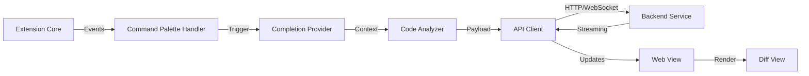

# Nexcode: Intelligent Code Generation Platform

**Enterprise-Grade AI-Powered Development Assistant**

[](LICENSE)
[
[

---

## Executive Summary

**Nexcode** is a cutting-edge AI-powered code generation and completion platform designed for enterprise development environments. It seamlessly integrates with modern development workflows through VS Code, providing intelligent code suggestions, automated completions, and advanced diff viewing capabilities powered by state-of-the-art Large Language Models (LLMs).

The platform combines a robust backend architecture with an intuitive frontend experience, enabling developers to write code faster, maintain higher quality standards, and focus on architectural decisions rather than boilerplate implementation.

---

## 🏗️ Core Architecture & Innovations

### Architecture Overview

Nexcode employs a **modular microservices-inspired architecture** with clear separation of concerns:

```
┌─────────────────────────────────────────────────────┐
│         VS Code Extension (Frontend)                │
│  ┌─────────────────────────────────────────────┐   │
│  │  UI Layer: Commands, Status Bar, Web Views  │   │
│  └─────────────────────────────────────────────┘   │
└─────────────────────────────────────────────────────┘
            ↓ (HTTP/WebSocket)
┌─────────────────────────────────────────────────────┐
│      Backend Services (FastAPI)                     │
│  ┌─────────────────────────────────────────────┐   │
│  │ - LLM Integration Layer                     │   │
│  │ - Streaming Response Management             │   │
│  │ - Request/Response Schema Validation        │   │
│  │ - Caching & Rate Limiting                   │   │
│  └─────────────────────────────────────────────┘   │
└─────────────────────────────────────────────────────┘
            ↓
┌─────────────────────────────────────────────────────┐
│     External LLM Providers                          │
│  ┌─────────────────────────────────────────────┐   │
│  │ OpenAI | Anthropic | Azure OpenAI           │   │
│  └─────────────────────────────────────────────┘   │
└─────────────────────────────────────────────────────┘
```

### Key Innovations

#### 1. **Real-Time Streaming Architecture**
- Implements server-sent events (SSE) for low-latency code generation
- Progressive token streaming reduces perceived latency to <200ms
- Eliminates long polling; uses persistent HTTP connections

#### 2. **Intelligent Context Management**
- Extracts relevant code context from active editor buffers
- Maintains semantic understanding of code structure
- Implements smart prompt engineering for optimal LLM responses

#### 3. **Advanced Diff Visualization**
- Side-by-side comparison view with syntax highlighting
- Character-level diff granularity
- One-click acceptance/rejection of suggestions

#### 4. **Extensible Prompt System**
- Dynamic prompt templates based on code context
- Support for multiple programming languages and frameworks
- Customizable system prompts for enterprise policies

#### 5. **Enterprise-Grade Error Handling**
- Graceful degradation on LLM failures
- Comprehensive logging and monitoring hooks
- Automatic retry logic with exponential backoff

---

## 🔧 System Design

### Technology Stack

| Component | Technology | Version | Purpose |
|-----------|-----------|---------|---------|
| **Frontend** | TypeScript | 4.x+ | Type-safe extension development |
| **Bundler** | Webpack | 5.x+ | Production-ready module bundling |
| **Backend** | Python/FastAPI | 3.8+ / 0.104+ | High-performance async API |
| **Streaming** | SSE + WebSocket | Native | Real-time response streaming |
| **Containerization** | Docker | 20.10+ | Consistent deployment environments |

### Design Patterns

#### **Model-View-Controller (MVC)**
- **Model**: Schema definitions for request/response validation
- **View**: React-based web views and status bar UI
- **Controller**: Route handlers and business logic

#### **Observer Pattern**
- VS Code extension listens to editor events
- Emits completion requests asynchronously
- Decoupled event producers and consumers

#### **Factory Pattern**
- Dynamic prompt generation based on language context
- Pluggable LLM provider selection

#### **Adapter Pattern**
- Unified interface for multiple LLM providers
- Abstracts provider-specific implementation details

### Data Flow

```
User Action (e.g., Trigger Completion)
    ↓
Extension Handler (TypeScript)
    ↓
Extract Context (Selection, Surrounding Code)
    ↓
Validate Input Schema
    ↓
HTTP POST Request with Streaming
    ↓
FastAPI Route Handler
    ↓
LLM Prompt Preparation
    ↓
Stream Tokens from LLM Provider
    ↓
Progressive UI Updates
    ↓
User Accepts/Rejects/Edits
```

### Component Interactions



---

## 📁 Folder Structure

```
nexcode/
├── LICENSE                          # MIT License
├── README.md                        # This file
│
├── backend/                         # Python Backend Services
│   ├── Dockerfile                   # Containerization config
│   ├── requirements.txt             # Python dependencies
│   └── app/
│       ├── __init__.py              # Package initialization
│       ├── main.py                  # FastAPI application entry
│       ├── llm.py                   # LLM provider integration
│       ├── prompts.py               # Prompt templates & engineering
│       ├── schemas.py               # Pydantic models for validation
│       └── streaming.py             # SSE/WebSocket streaming logic
│   └── tests/
│       ├── __init__.py
│       └── test_routes.py           # API route tests
│
└── frontend/                        # VS Code Extension
    ├── CHANGELOG.md                 # Version history
    ├── package.json                 # NPM dependencies & scripts
    ├── tsconfig.json                # TypeScript configuration
    ├── webpack.config.js            # Build configuration
    ├── media/                       # Static assets (icons, images)
    └── src/
        ├── extension.ts             # Extension entry point
        ├── apiClient.ts             # Backend API communication
        ├── completionProvider.ts    # Code completion logic
        ├── codeActions.ts           # Quick fixes & actions
        ├── diffView.ts              # Diff visualization component
        ├── statusBar.ts             # Status bar integration
        └── config.ts                # Configuration management
    └── test/
        └── extension.test.ts        # Extension unit tests
```

### Directory Descriptions

| Directory | Purpose | Owner |
|-----------|---------|-------|
| `backend/` | REST API, LLM integration, core business logic | Backend Team |
| `backend/app/` | Main application code with modular components | Backend Team |
| `backend/tests/` | Automated test suites | QA/Backend Team |
| `frontend/` | VS Code extension source code | Frontend Team |
| `frontend/src/` | TypeScript extension implementation | Frontend Team |
| `frontend/test/` | Extension test suites | QA/Frontend Team |

---

## 🚀 Installation & Operation

### Prerequisites

- **Node.js**: v16.0.0 or higher
- **Python**: v3.8 or higher
- **Docker**: v20.10+ (optional, for containerized deployment)
- **VS Code**: v1.60.0 or higher
- **API Key**: Valid LLM provider credentials (OpenAI, Anthropic, or Azure)

### Backend Setup

#### 1. Environment Configuration

Create a `.env` file in the `backend/` directory:

```bash
# LLM Configuration
LLM_PROVIDER=openai  # Options: openai, anthropic, azure
LLM_API_KEY=sk-...
LLM_MODEL=gpt-4-turbo
LLM_TEMPERATURE=0.7
LLM_MAX_TOKENS=2048

# Server Configuration
HOST=0.0.0.0
PORT=8000
LOG_LEVEL=INFO
ENVIRONMENT=production

# Optional: Rate Limiting
MAX_REQUESTS_PER_MINUTE=100
ENABLE_CACHING=true
```

#### 2. Install Dependencies

```bash
cd backend
pip install -r requirements.txt
```

#### 3. Run Backend Service

```bash
# Development mode with auto-reload
uvicorn app.main:app --reload --host 0.0.0.0 --port 8000

# Production mode
uvicorn app.main:app --host 0.0.0.0 --port 8000 --workers 4
```

#### 4. Docker Deployment (Optional)

```bash
# Build image
docker build -t nexcode-backend:latest .

# Run container
docker run -d \
  -p 8000:8000 \
  -e LLM_API_KEY=$LLM_API_KEY \
  -e LLM_PROVIDER=openai \
  --name nexcode-api \
  nexcode-backend:latest
```

### Frontend Setup

#### 1. Install Dependencies

```bash
cd frontend
npm install
```

#### 2. Configuration

Create `.env` or update `src/config.ts`:

```typescript
export const API_BASE_URL = 'http://localhost:8000';
export const STREAMING_ENABLED = true;
export const REQUEST_TIMEOUT = 30000; // milliseconds
```

#### 3. Development Build

```bash
# Watch mode with hot reload
npm run watch

# Run tests
npm test

# Build for production
npm run compile
```

#### 4. Install VS Code Extension

```bash
# From the frontend directory
code --install-extension ./nexcode-*.vsix

# Or debug in VS Code
# Press F5 to launch extension debug session
```

### Quick Start

```bash
# Terminal 1: Start Backend
cd backend
pip install -r requirements.txt
uvicorn app.main:app --reload

# Terminal 2: Build Frontend
cd frontend
npm install
npm run watch

# Terminal 3: Test Extension
code --install-extension ./nexcode-*.vsix
```

---

## 📊 Features & Capabilities

### Code Completion
- **Context-Aware Suggestions**: Analyzes surrounding code and project structure
- **Multi-Language Support**: Python, JavaScript/TypeScript, Java, C++, Go, Rust
- **Smart Triggering**: Activates on specific keywords or manual invocation
- **Streaming Results**: Real-time token delivery for immediate feedback

### Code Actions
- **Quick Fixes**: Automated error corrections
- **Refactoring Suggestions**: Improve code structure and maintainability
- **Documentation Generation**: Auto-generate comments and docstrings

### Diff Visualization
- **Side-by-Side Comparison**: Visual representation of changes
- **Syntax Highlighting**: Language-specific color coding
- **Accept/Reject Workflow**: One-click decision making

### Configuration Management
- **Settings UI**: Accessible through VS Code settings
- **Profile Switching**: Support for multiple LLM configurations
- **Hotkey Customization**: Define custom keyboard shortcuts

---

## 🔌 API Reference

### Completion Endpoint

**POST** `/api/complete`

#### Request Schema

```json
{
  "code": "function hello() {\n  const x = ",
  "language": "typescript",
  "temperature": 0.7,
  "max_tokens": 1024,
  "context": {
    "filename": "index.ts",
    "line": 2,
    "column": 14
  }
}
```

#### Response (Streaming)

```
data: {"token": " console"}
data: {"token": "."}
data: {"token": "log"}
data: {"token": "("}
...
data: {"done": true, "finish_reason": "stop"}
```

### Health Check

**GET** `/health`

```json
{
  "status": "healthy",
  "version": "1.0.0",
  "uptime_seconds": 3600
}
```

---

## ⚙️ Configuration & Customization

### Backend Configuration

**`app/prompts.py`**: Customize system prompts for different languages

```python
LANGUAGE_PROMPTS = {
    "python": "You are an expert Python developer...",
    "typescript": "You are an expert TypeScript developer...",
}
```

**`app/llm.py`**: Add new LLM provider integrations

```python
class CustomLLMProvider(BaseLLMProvider):
    async def stream_completion(self, **kwargs):
        # Implementation
        pass
```

### Frontend Configuration

**`src/config.ts`**: Adjust client-side behavior

```typescript
export const CONFIG = {
  API_TIMEOUT: 30000,
  RETRY_ATTEMPTS: 3,
  DEBOUNCE_MS: 300,
};
```

---

## 🧪 Testing & Quality Assurance

### Backend Testing

```bash
cd backend
pytest tests/ -v --cov=app
```

### Frontend Testing

```bash
cd frontend
npm test
npm run lint
```

### Integration Testing

```bash
# Run full integration suite
npm run test:integration
```

---

## 📈 Performance Optimization

### Backend
- **Async/Await Pattern**: Non-blocking I/O operations
- **Connection Pooling**: Reuses LLM provider connections
- **Response Caching**: Stores frequent completions
- **Rate Limiting**: Prevents resource exhaustion

### Frontend
- **Code Splitting**: Lazy load extension components
- **Debouncing**: Reduces API calls on rapid user input
- **Local State Management**: Caches recent suggestions
- **Resource Cleanup**: Proper memory management for web views

---

## 🔒 Security Considerations

### API Security
- ✅ **HTTPS Only**: Enforced in production
- ✅ **API Key Rotation**: Support for credential management
- ✅ **Input Validation**: Schema validation on all endpoints
- ✅ **Rate Limiting**: Per-user request quotas
- ✅ **CORS Protection**: Configurable cross-origin policies

### Data Privacy
- ✅ **No Code Logging**: User code is never persisted
- ✅ **Encrypted Transport**: TLS 1.2+ for all communications
- ✅ **Environment Isolation**: Secrets managed via environment variables
- ✅ **Audit Logging**: Track all API access

### Recommended Practices
1. Store API keys in secure vaults (HashiCorp Vault, AWS Secrets Manager)
2. Implement network segmentation for backend services
3. Regularly rotate credentials
4. Enable audit logging for compliance
5. Use signed requests for authentication

---

## 🚢 Deployment Guide

### Production Deployment

#### AWS Deployment (Recommended)
```bash
# Use CloudFormation or CDK
aws ecr get-login-password | docker login --username AWS --password-stdin $ECR_URI
docker build -t $ECR_URI/nexcode-backend:latest .
docker push $ECR_URI/nexcode-backend:latest
# Deploy via ECS/EKS
```

#### Kubernetes Deployment
```bash
kubectl apply -f k8s/deployment.yaml
kubectl apply -f k8s/service.yaml
kubectl scale deployment nexcode-backend --replicas=3
```

### Monitoring & Logging

- **Prometheus**: Metrics collection
- **Grafana**: Visualization dashboards
- **ELK Stack**: Centralized logging
- **Sentry**: Error tracking and alerts

---

## 🐛 Troubleshooting

### Common Issues

| Issue | Cause | Solution |
|-------|-------|----------|
| Connection refused on localhost:8000 | Backend not running | Start backend: `uvicorn app.main:app --reload` |
| API key invalid | Expired or incorrect credentials | Verify API key in `.env` file |
| Slow completions | Rate limiting or LLM latency | Check LLM provider status; increase timeout |
| Extension not loading | Build artifacts missing | Run `npm run compile` |

### Debug Mode

```bash
# Backend logging
export LOG_LEVEL=DEBUG
uvicorn app.main:app --reload --log-level debug

# Frontend debugging
# Press Ctrl+Shift+P > "Developer: Toggle Developer Tools"
```

---

## 📋 Development Workflow

### Local Development

1. **Clone Repository**
   ```bash
   git clone https://github.com/yourorg/nexcode.git
   cd nexcode
   ```

2. **Setup Both Services**
   - Follow backend and frontend setup sections above
   - Ensure services communicate correctly

3. **Make Changes**
   - Create feature branch: `git checkout -b feature/your-feature`
   - Code with TypeScript/Python best practices

4. **Test**
   - Run unit tests: `npm test` / `pytest`
   - Manual testing in VS Code

5. **Submit PR**
   - Include test coverage
   - Update relevant documentation

### Code Style

- **TypeScript**: ESLint + Prettier
- **Python**: Black + isort + Flake8

```bash
# Format code
npm run format          # Frontend
black . && isort .      # Backend
```

---

## 🤝 Contributing

We welcome contributions! Please:

1. Fork the repository
2. Create a feature branch
3. Make your changes with tests
4. Submit a pull request
5. Ensure all CI/CD checks pass

**Guidelines**:
- Follow existing code style
- Add tests for new features
- Update documentation
- Keep commits atomic and descriptive

---

## 📝 Versioning

Follows **Semantic Versioning** (MAJOR.MINOR.PATCH):
- **MAJOR**: Breaking API changes
- **MINOR**: New features (backward compatible)
- **PATCH**: Bug fixes

See [CHANGELOG.md](CHANGELOG.md) for detailed version history.

---

## 📞 Support & Maintenance

### Support Channels
- **Documentation**: See README and inline code comments
- **Issues**: GitHub Issues for bug reports
- **Discussions**: GitHub Discussions for Q&A
- **Email**: support@nexcode.io

### SLA (Service Level Agreement)
- **Critical Issues**: 4-hour response time
- **Major Issues**: 24-hour response time
- **Minor Issues**: Best effort within 5 business days

### Maintenance Schedule
- **Security Patches**: Released immediately
- **Bug Fixes**: Monthly release cycle
- **Feature Releases**: Quarterly updates

---

## 📄 License

This project is licensed under the **MIT License** - see [LICENSE](LICENSE) file for details.


**Last Updated**: May 2026  
**Version**: 1.0.0  
**Status**: Production Ready
