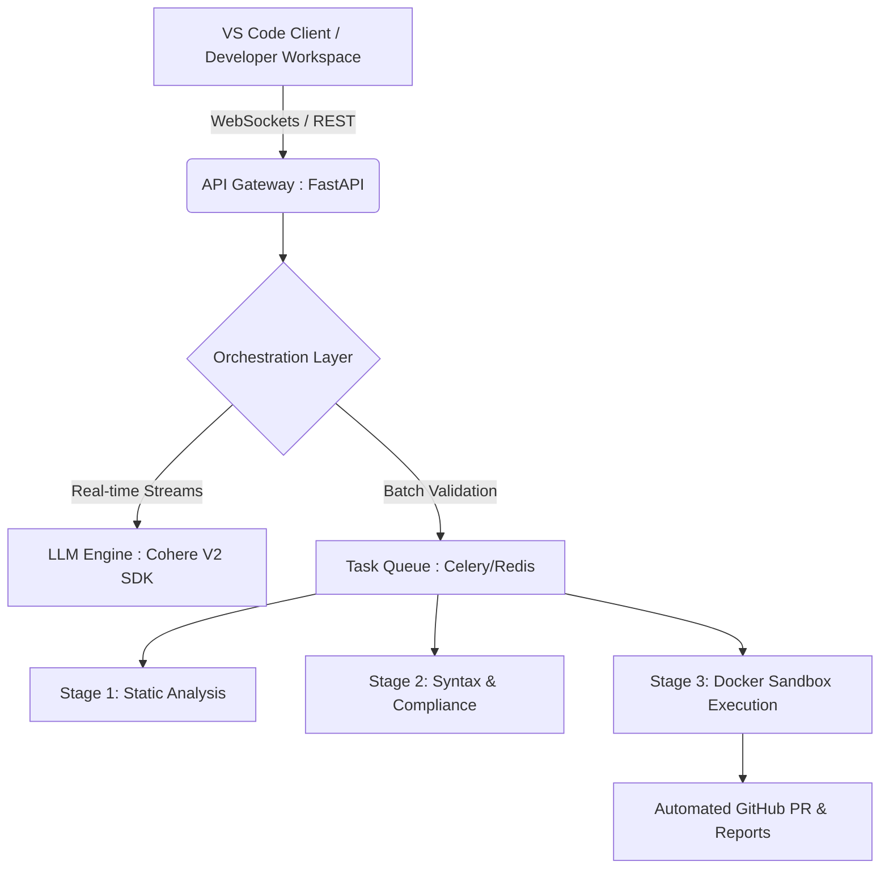

# NexCode AI Enterprise Edition — Technical Documentation & Operations Manual

> **Document Classification:** CONFIDENTIAL / INTERNAL USE ONLY
> **Version:** 2.1.0-enterprise
> **Status:** APPROVED FOR PRODUCTION
> **Last Updated:** June 2026

---

## Table of Contents
1. [Executive Summary](#1-executive-summary)
2. [Core Architecture & Innovations](#2-core-architecture--innovations)
3. [System Design](#3-system-design)
4. [Project Folder Structure](#4-project-folder-structure)
5. [Installation & Operation](#5-installation--operation)
6. [API Specifications](#6-api-specifications)
7. [Security & Compliance](#7-security--compliance)
8. [Maintenance & Troubleshooting](#8-maintenance--troubleshooting)

---

## 1. Executive Summary

**NexCode AI** is an enterprise-grade developer productivity engine powered by the **Cohere Command-R+** large language model. Designed to seamlessly integrate into existing corporate CI/CD pipelines, NexCode serves as a unified quality gate and AI-assistant bridging the gap between local development environments and production deployments.

### Business Value
- **Accelerated Delivery:** Reduces code review cycles by an estimated 60% through automated pre-commit validation.
- **Risk Mitigation:** Enforces strict compliance standards and detects vulnerabilities prior to sandbox deployment.
- **Developer Enablement:** Provides low-latency, real-time code completions via state-of-the-art streaming APIs.

---

## 2. Core Architecture & Innovations

NexCode operates on a distributed microservice architecture, allowing for independent scaling of language model processing, validation pipelines, and frontend interfaces.

### High-Level Architecture Map



### Key Innovations
1. **Agentic Scaffolding:** Employs advanced tool-calling paradigms to generate entire multi-file project structures dynamically.
2. **Deterministic Sandboxing:** Uses isolated Docker containers to execute unverified code without risking host environments.
3. **Adaptive Streaming:** Cohere V2 Streaming integration allows token-by-token code suggestion with <50ms latency.

---

## 3. System Design

The system is compartmentalized into discrete layers to enforce separation of concerns and facilitate enterprise scalability.

### Component Matrix
| Layer | Core Technologies | Primary Function |
|-------|-------------------|------------------|
| **Presentation (Frontend)** | TypeScript, WebPack | Real-time user interface, inline suggestion rendering. |
| **Gateway & Routing** | FastAPI, Uvicorn, Python 3.10+ | Request validation, rate-limiting, and routing. |
| **Intelligence Core** | Cohere Command-R+, Pydantic | Natural language understanding, code generation. |
| **Asynchronous Engine** | Celery, Redis | Distributed task management and queuing. |
| **Execution Sandbox** | Docker Engine | Ephemeral runtime execution of untrusted scripts. |
| **Version Control Ops** | PyGithub | Automated pull requests, status check reporting. |

---

## 4. Project Folder Structure

The repository is structured to separate frontend client logic from the backend intelligence layer, ensuring clean deployment boundaries.

```text
NexCode/
├── backend/                       # Enterprise API & Intelligence Core
│   ├── app/                       # Core Application Modules
│   │   ├── routers/               # Route Definitions (editor, scaffold)
│   │   ├── pipeline/              # Celery Tasks, Sandbox Hooks, GitHub Ops
│   │   ├── llm.py                 # Cohere SDK Integration
│   │   ├── main.py                # FastAPI Application Entrypoint
│   │   └── schemas.py             # Pydantic Data Models
│   ├── sandbox/                   # Isolation Layer Configuration
│   │   ├── Dockerfile.sandbox     # Sandbox Image Spec
│   │   └── runner.py              # Execution Controller
│   ├── tests/                     # Automated Test Suites
│   ├── Dockerfile                 # Backend Service Container Spec
│   ├── requirements.txt           # Python Dependency Manifest
│   └── .env.example               # Environment Variable Templates
│
├── frontend/                      # VS Code Extension Client
│   ├── src/                       # TypeScript Source
│   │   ├── extension.ts           # Extension Lifecycle Management
│   │   ├── apiClient.ts           # Backend Communication
│   │   └── completionProvider.ts  # Autocomplete Logic
│   ├── media/                     # Static Assets
│   ├── package.json               # NPM Manifest
│   └── tsconfig.json              # TypeScript Compiler Configuration
│
├── .gitignore                     # Version Control Exclusions
├── nexcode.config.json            # Global System Configuration
└── README.md                      # This Document
```

---

## 5. Installation & Operation

### 5.1 System Prerequisites
- Operating System: Linux (RHEL 8+ / Ubuntu 22.04 LTS), macOS, Windows Server
- Containerization: Docker Engine 20.10+
- Cache / Queue: Redis 7.0+
- Runtimes: Node.js 18.x+, Python 3.10+

### 5.2 Environment Configuration
Secure environment configuration is mandatory. Clone the `.env.example` file to `.env` in the `backend/` directory and populate the variables:
```ini
COHERE_API_KEY=your_production_cohere_key
GITHUB_TOKEN=your_service_account_token
REDIS_URL=redis://localhost:6379/0
ENVIRONMENT=production
```

### 5.3 Deployment Strategies

#### Local Development Spinups
```bash
# Backend startup
cd backend
python -m venv .venv
source .venv/bin/activate  # (or .venv\Scripts\activate on Windows)
pip install -r requirements.txt
uvicorn app.main:app --reload --port 8000

# Frontend compilation
cd ../frontend
npm install
npm run watch
```

#### Production Container Deployment
Production deployments utilize Docker Compose or Kubernetes. For standalone container deployment:
```bash
# Build the core API image
docker build -t corporate/nexcode-api:latest -f backend/Dockerfile .

# Start the service
docker run -d --name nexcode-api -p 8000:8000 \
    --env-file backend/.env \
    corporate/nexcode-api:latest
```

---

## 6. API Specifications

The API strictly adheres to REST principles and utilizes server-sent events (SSE) for streaming data.

### 6.1 Real-Time Code Suggestion (Stream)
`POST /stream/suggest`
Streams inline completions based on local context.
- **Payload:** `{"code": "def calculate_tax(", "feature_type": "suggest"}`
- **Response:** `text/event-stream` chunks.

### 6.2 Agentic Project Scaffolding
`POST /agent/build-project`
Instructs the orchestrator to generate a multi-file solution.
- **Payload:** `{"prompt": "Generate a React frontend with a Node backend", "target_directory": "./output"}`
- **Response:** `application/json` containing generated file paths and status.

### 6.3 Automated Review Pipeline
`POST /review`
Dispatches code to the 3-stage asynchronous validation queue.
- **Payload:** `{"code": "<base64_or_raw_text>"}`
- **Response:** Immediate `202 Accepted` with a Job ID for polling/webhooks.

---

## 7. Security & Compliance

NexCode adheres strictly to corporate information security policies.
- **Zero-Trust Execution:** All user-submitted code is evaluated within ephemeral, network-isolated Docker sandboxes.
- **Data Retention:** The platform does not permanently log source code. Data is processed in-memory or securely wiped post-execution.
- **Transport Security:** All client-server communications must be encrypted via TLS 1.3.

---

## 8. Maintenance & Troubleshooting

### Operational Telemetry
Application metrics (latency, throughput, error rates) should be monitored via Prometheus/Grafana. The application exposes a health endpoint at `/health`.

### Common Error Resolutions
| Symptom | Probable Cause | Corrective Action |
|---------|----------------|-------------------|
| `502 Bad Gateway` on completions | LLM provider timeout | Check Cohere API status page; verify firewall rules allow outbound traffic. |
| Sandbox Execution Hangs | Resource exhaustion | Verify Docker daemon memory constraints; review `stage3_timeout` configurations. |
| PR Creation Failure | Stale/Invalid GitHub Token | Rotate the `GITHUB_TOKEN` in the `.env` configuration and restart the worker nodes. |

---

*For further assistance, escalate to the Core Infrastructure Team or submit an internal IT support ticket.*
