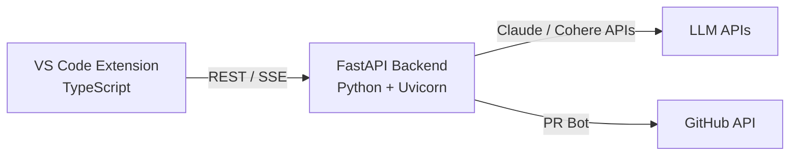

<div align="center">

#  NexCode AI

### The Intelligent VS Code Extension & Pipeline Automation Tool

[](https://www.typescriptlang.org/)
[](https://fastapi.tiangolo.com/)
[](https://anthropic.com/)
[](https://cohere.com/)
[](https://docker.com/)
[](#)

**NexCode** is an AI-powered VS Code extension inspired by GitHub Copilot. It helps developers write, debug, and understand code using Large Language Models — and uniquely integrates with company CI/CD pipelines to automate code scanning and PR creation before code reaches production.

[Overview](#1-project-overview) · [Features](#2-core-features) · [Architecture](#3-architecture) · [Setup & Installation](#7-setup--installation)

</div>

---

## Table of Contents

- [1. Project Overview](#1-project-overview)
- [2. Core Features](#2-core-features)
- [3. Architecture](#3-architecture)
- [4. Technology Stack](#4-technology-stack)
- [5. Project Structure](#5-project-structure)
- [6. Pipeline Integration — Deep Dive](#6-pipeline-integration--deep-dive)
- [7. Setup & Installation](#7-setup--installation)
- [8. Keyboard Shortcuts & Commands](#8-keyboard-shortcuts--commands)
- [9. Recommended Build Order](#9-recommended-build-order)
- [10. Dependencies](#10-dependencies)
- [11. Publishing to VS Code Marketplace](#11-publishing-to-vs-code-marketplace)

---

## 1. Project Overview

**VISION**: An AI developer tool that doesn't just help you write code — it helps you ship it safely, with automated 3-stage scanning, replica environment testing, and intelligent PR creation.

### 1.1 What Makes NexCode Different
Most AI coding tools stop at code generation. NexCode goes further:
- **Inline ghost-text completions** (like Copilot)
- **AI code generation** from comments or instructions
- **Intelligent bug detection and fixing** with diff preview
- **Pipeline integration** — connects to any company's CI/CD via MCP/JSON
- **3-stage AI code scanning** before any PR is raised
- **Replica environment testing** — never touches real production directly

### 1.2 Target Users

| User Type | Use Case | Key Feature |
|-----------|----------|-------------|
| **Individual Developers** | Faster coding with AI assistance | Completions + Generate + Fix |
| **Engineering Teams** | Automated pre-PR code review | Pipeline Integration |
| **Tech Companies** | Connect existing CI/CD to AI scanning | MCP Server + JSON Config |
| **Open Source Maintainers** | Auto PR review and quality gates | 3-Stage Scan + GitHub PR Bot |

---

## 2. Core Features

### 2.1 Feature 1 — Inline Code Suggestion
Ghost-text completions appear as you type, similar to GitHub Copilot. The extension uses VS Code's `InlineCompletionItemProvider` API with a 400ms debounce to avoid excessive API calls.

> **HOW IT WORKS**: As you type, NexCode captures the last 50 lines of code as context and sends it to the FastAPI backend. Claude generates a natural continuation which appears as greyed-out ghost text. Press `Tab` to accept.

- Triggered automatically on every keystroke (debounced 400ms)
- Sends language ID + code prefix as context
- `Tab` to accept, `Escape` to dismiss
- Configurable via `nexcode.enableInlineCompletion` setting

### 2.2 Feature 2 — Complete Code
Select a comment, function signature, or natural language instruction. Run **NexCode: Generate Code** (`Ctrl+Shift+G`) and the AI writes the full implementation directly in the editor.

> **HOW IT WORKS**: The selected text becomes the instruction. Claude generates a complete code block with comments. The result replaces the selection in-place — no separate panel needed.

### 2.3 Feature 3 — Bug Fixing
Select buggy or broken code. Run **NexCode: Fix Bug** (`Ctrl+Shift+F`). The AI analyses the code, identifies the issue, and proposes a corrected version shown as an inline diff for review before accepting.

> **HOW IT WORKS**: Selected code is sent to the backend with a bug-fixing prompt. The response is shown via `vscode.diff()` as a side-by-side comparison. Developer accepts or rejects the fix.

### 2.4 Feature 4 — Pipeline Integration *(Unique Feature)*
This is what separates NexCode from every other AI coding tool. Connect to any company's CI/CD pipeline via a simple JSON config or MCP server. NexCode's AI agent (powered by Cohere) scans code through 3 stages before raising a PR.

| Stage | Name | What the AI Checks | LLM Used |
|-------|------|--------------------|----------|
| **Stage 1** | Basic Bug Check | Null refs, undefined vars, type mismatches, obvious errors | Cohere Command-R+ |
| **Stage 2** | Syntax & Keywords | Syntax correctness, deprecated APIs, banned keywords, standards | Cohere Command-R+ |
| **Stage 3** | Full Scan + Run | Complete analysis + runs code in Docker replica environment | Cohere Command-R+ |
| **Final** | PR Creation | Creates branch, raises PR with AI review summary, notifies dev | GitHub API Bot |

---

## 3. Architecture

### 3.1 System Architecture
NexCode follows a client-server architecture. The VS Code extension (TypeScript) is the client. The FastAPI server (Python) handles all LLM communication. The two communicate over HTTP on `localhost:8000`.



### 3.2 API Routes

| Method | Route | Description | LLM |
|--------|-------|-------------|-----|
| `POST` | `/complete` | Inline code completion (ghost text) | Claude |
| `POST` | `/generate` | Generate code from instruction | Claude |
| `POST` | `/fix` | Fix buggy code selection | Claude |
| `POST` | `/explain` | Explain selected code in plain English | Claude |
| `POST` | `/pipeline/scan` | Run 3-stage AI scan on code | Cohere |
| `POST` | `/pipeline/pr` | Raise GitHub PR after scan passes | GitHub API |
| `GET` | `/pipeline/status/{job_id}` | Check pipeline job status | — |

---

## 4. Technology Stack

### 4.1 Frontend — VS Code Extension
| Technology | Version | Purpose |
|------------|---------|---------|
| **TypeScript** | 5.0+ | Extension language — type safety + VS Code API types |
| **VS Code API** | 1.85+ | `InlineCompletionItemProvider`, commands, diff view, status bar |
| **Webpack** | 5.0+ | Bundle TypeScript into single `dist/extension.js` file |
| **vsce** | Latest | Package to `.vsix` and publish to VS Code Marketplace |
| **ESLint + Prettier** | Latest | Code linting and formatting |

### 4.2 Backend — FastAPI Server
| Technology | Version | Purpose |
|------------|---------|---------|
| **Python** | 3.10+ | Backend language — best LLM SDK ecosystem |
| **FastAPI** | 0.110+ | Async REST API framework with auto OpenAPI docs |
| **Uvicorn** | 0.27+ | ASGI server — runs FastAPI with hot reload |
| **Pydantic** | 2.0+ | Request/response validation and schemas |
| **python-dotenv** | Latest | Load API keys from `.env` file safely |

### 4.3 AI / LLM Layer
| Technology | Model | Used For |
|------------|-------|----------|
| **Anthropic Claude** | `claude-sonnet-4-20250514` | Completions, code generation, bug fixing, explanation |
| **Cohere** | `command-r-plus` | Pipeline AI agent — 3-stage code scanning |
| **Streaming (SSE)** | `FastAPI StreamingResponse` | Token-by-token output for better UX |

### 4.4 Pipeline & Infrastructure
| Technology | Purpose |
|------------|---------|
| **PyGithub** | Create branches and raise PRs automatically via GitHub API |
| **Docker** | Spin up replica sandbox environment for Stage 3 testing |
| **Celery + Redis** | Job queue system for async pipeline stage processing |
| **httpx** | Async HTTP client for MCP server connections |
| **MCP Server (JSON)**| Connect to company cloud infrastructure via config file |
| **Vercel API** | Deployment integration after PR is merged |

---

## 5. Project Structure

The project is split into two completely separate folders: `frontend` (VS Code extension in TypeScript) and `backend` (FastAPI server in Python). This clean separation makes it easy to develop, test, and deploy each independently.

```text
NEXCODE/
├── frontend/                     # VS Code Extension (TypeScript)
│   ├── src/
│   │   ├── extension.ts          # Entry point — activate(), register all
│   │   ├── completionProvider.ts # Ghost-text inline completions
│   │   ├── codeActions.ts        # Generate, fix, explain commands
│   │   ├── apiClient.ts          # HTTP calls to FastAPI backend
│   │   ├── diffView.ts           # Diff preview before accepting AI fix
│   │   ├── statusBar.ts          # AI status bar indicator
│   │   └── config.ts             # Read workspace settings
│   ├── media/icon.png            # 128x128 marketplace icon
│   ├── test/extension.test.ts    # Unit tests
│   ├── package.json              # Contributes, commands, keybindings
│   ├── tsconfig.json             # TypeScript compiler config
│   ├── webpack.config.js         # Bundle to dist/extension.js
│   └── CHANGELOG.md              # Required by vsce to publish
│
├── backend/                      # FastAPI Server (Python)
│   ├── app/
│   │   ├── main.py               # All API routes
│   │   ├── llm.py                # Anthropic Claude abstraction
│   │   ├── prompts.py            # System prompts per feature
│   │   ├── schemas.py            # Pydantic request/response models
│   │   ├── streaming.py          # StreamingResponse helpers
│   │   │
│   │   ├── pipeline/             # Pipeline feature (NEW)
│   │   │   ├── agent.py          # Cohere AI agent coordinator
│   │   │   ├── stage1_bugs.py    # Stage 1: basic bug check
│   │   │   ├── stage2_syntax.py  # Stage 2: syntax + keywords
│   │   │   ├── stage3_run.py     # Stage 3: replica run
│   │   │   ├── github_pr.py      # Raise PR via PyGithub
│   │   │   ├── mcp_connect.py    # MCP server connector
│   │   │   └── queue.py          # Celery job queue
│   │   │
│   │   └── sandbox/              # Docker replica env (NEW)
│   │       ├── Dockerfile.sandbox
│   │       └── runner.py         # Spin up + run code safely
│   │
│   ├── tests/test_routes.py
│   ├── requirements.txt
│   ├── .env                      # API keys (never commit)
│   └── Dockerfile                # Deploy to Railway/Render
│
├── nexcode.config.json           # Company credentials + MCP config
├── .gitignore
└── README.md
```

---

## 6. Pipeline Integration — Deep Dive

### 6.1 How the Pipeline Works
The pipeline is the unique differentiator of NexCode. Instead of just writing code, NexCode helps ship code safely by running it through 3 AI-powered stages before any PR reaches the real repository.

- ⚙️ **Connect via JSON / MCP Server**: Company provides `nexcode.config.json` with their GitHub token, MCP server URL, and cloud credentials. NexCode reads this to connect to their existing pipeline infrastructure.
- 1️⃣ **Stage 1 — Basic Bug Check (Cohere LLM)**: Cohere agent does a fast scan for obvious bugs: null references, undefined variables, type mismatches, unreachable code, and missing error handling. Returns pass/fail with specific line numbers.
- 2️⃣ **Stage 2 — Syntax & Keywords Check (Cohere LLM)**: Deep analysis of syntax correctness, deprecated API usage, banned keywords, and company-specific coding standards. LLM cross-references standards if provided in config.
- 3️⃣ **Stage 3 — Full Scan + Replica Run (Docker)**: Complete code analysis. A Docker sandbox spins up as a replica environment, the code runs on localhost, outputs and errors are captured. Only if this passes does it proceed.
- ✅ **PR Raised — NexCode Bot Commits**: NexCode bot creates a new branch (never commits to `main` directly), raises a PR with a full AI-generated review summary, and notifies the developer via VS Code notification. Developer is always the final approver.

### 6.2 `nexcode.config.json` Format
```json
{
  "mcp_server": "https://mcp.yourcompany.com/sse",
  "github": {
    "repo": "org/repo-name",
    "token": "ghp_xxxxxxxxxxxx",
    "base_branch": "main"
  },
  "deployment": {
    "provider": "vercel",
    "token": "vc_xxxxxxxxxxxx"
  },
  "llm": {
    "provider": "cohere",
    "model": "command-r-plus"
  },
  "standards": {
    "banned_keywords": ["eval", "exec"],
    "max_function_lines": 50
  }
}
```

---

## 7. Setup & Installation

### 7.1 Prerequisites
| Tool | Version | Purpose |
|------|---------|---------|
| **Node.js** | 18+ | Frontend |
| **Python** | 3.10+ | Backend |
| **VS Code** | 1.85+ | Extension execution |
| **Docker Desktop** | Latest | Stage 3 sandbox testing |
| **Redis** | 7+ | Celery job queue |
| **Anthropic API Key** | — | Core code completion |
| **Cohere API Key** | — | Pipeline agent |
| **GitHub Token** | — | PR creation |

### 7.2 Frontend Setup (PowerShell — Windows)
```powershell
cd C:\Users\HP\Desktop\Nexcode\frontend
 
# Install dependencies
npm install
 
# Compile TypeScript
npm run compile
 
# Press F5 in VS Code to launch Extension Development Host
# Open Command Palette (Ctrl+Shift+P) -> type "NexCode"
```

### 7.3 Backend Setup
```powershell
cd C:\Users\HP\Desktop\Nexcode\backend
 
# Create virtual environment
python -m venv venv
venv\Scripts\activate
 
# Install all dependencies
pip install fastapi uvicorn anthropic cohere PyGithub docker celery redis httpx python-dotenv pydantic
 
# Create .env file and add your keys:
# ANTHROPIC_API_KEY=sk-ant-...
# COHERE_API_KEY=...
# GITHUB_TOKEN=ghp_...
 
# Start the server
uvicorn app.main:app --reload --port 8000
```

---

## 8. Keyboard Shortcuts & Commands

| Command | Shortcut | Description |
|---------|----------|-------------|
| **NexCode: Generate Code** | `Ctrl + Shift + G` | Generate code from selected comment/instruction |
| **NexCode: Fix Bug** | `Ctrl + Shift + F` | Fix selected buggy code with diff preview |
| **NexCode: Explain Code** | `Ctrl + Shift + E` | Explain selected code in plain English |
| **NexCode: Run Pipeline** | `Ctrl + Shift + P` | Run 3-stage scan and raise PR |
| **Accept Completion** | `Tab` | Accept ghost-text inline suggestion |
| **Dismiss Completion** | `Escape` | Dismiss ghost-text suggestion |

---

## 9. Recommended Build Order

Build NexCode incrementally. Don't try to build everything at once — complete each phase before moving to the next.

| Phase | What to Build | Estimated Time |
|-------|---------------|----------------|
| **Phase 1 — MVP** | Backend `/explain` route + Extension `explainCode` command + `apiClient.ts` | 1-2 days |
| **Phase 2 — Core** | Add `/complete`, `/generate`, `/fix` routes + `completionProvider.ts` + `codeActions.ts` | 2-3 days |
| **Phase 3 — Polish** | `diffView.ts`, `statusBar.ts`, `config.ts`, keyboard shortcuts, error handling | 1-2 days |
| **Phase 4 — Pipeline**| `stage1_bugs.py` + `stage2_syntax.py` + `github_pr.py` + Celery queue | 3-4 days |
| **Phase 5 — Sandbox** | Docker sandbox + `stage3_run.py` + `runner.py` replica environment | 2-3 days |
| **Phase 6 — Deploy** | MCP connect + Vercel API + `.vsix` packaging + Marketplace publish | 1-2 days |

> **PRO TIP**: Start with the `/explain` endpoint and `explainCode` command. It's the simplest (no streaming, no diff view) and gives you a working end-to-end proof of concept in a few hours. Build confidence before tackling the pipeline.

---

## 10. Dependencies

### 10.1 `backend/requirements.txt`
```text
fastapi==0.110.0
uvicorn==0.27.0
anthropic==0.21.0
cohere==5.1.0
PyGithub==2.2.0
docker==7.0.0
celery==5.3.0
redis==5.0.0
httpx==0.27.0
python-dotenv==1.0.0
pydantic==2.6.0
```

### 10.2 `frontend/package.json` devDependencies
```json
{
  "@types/vscode": "^1.85.0",
  "typescript": "^5.0.0",
  "webpack": "^5.0.0",
  "webpack-cli": "^5.0.0",
  "ts-loader": "^9.0.0",
  "@vscode/vsce": "^2.24.0",
  "eslint": "^8.0.0"
}
```

---

## 11. Publishing to VS Code Marketplace

1. Create publisher at [marketplace.visualstudio.com/manage](https://marketplace.visualstudio.com/manage)
2. Generate Personal Access Token on Azure DevOps
3. Login: `vsce login your-publisher-id`
4. Add `icon.png` (128x128) to `frontend/media/`
5. Fill in `CHANGELOG.md` and `README.md`
6. Package: `npm run package` (creates `.vsix` file)
7. Publish: `vsce publish`

> **LOCAL INSTALL**: To test locally before publishing: `code --install-extension nexcode-0.1.0.vsix` or drag the `.vsix` file into the VS Code Extensions panel.

### 11.1 Marketplace Checklist
- [ ] `README.md` with screenshots or GIFs (listings with GIFs convert much better)
- [ ] `CHANGELOG.md` — required by vsce
- [ ] `icon.png` — 128x128px, set in `package.json` under `icon`
- [ ] Categories: `["AI", "Other"]` in `package.json`
- [ ] Keywords for discoverability: `["ai", "copilot", "code completion", "pipeline"]`
- [ ] License file
- [ ] GitHub repository linked in `package.json` under `repository`

---
<div align="center">
<b>NexCode AI Extension</b><br/>
<i>TypeScript  •  FastAPI  •  Anthropic Claude  •  Cohere  •  GitHub API  •  Docker</i><br/>
Build it phase by phase. Start with /explain. Ship something real.
</div>
